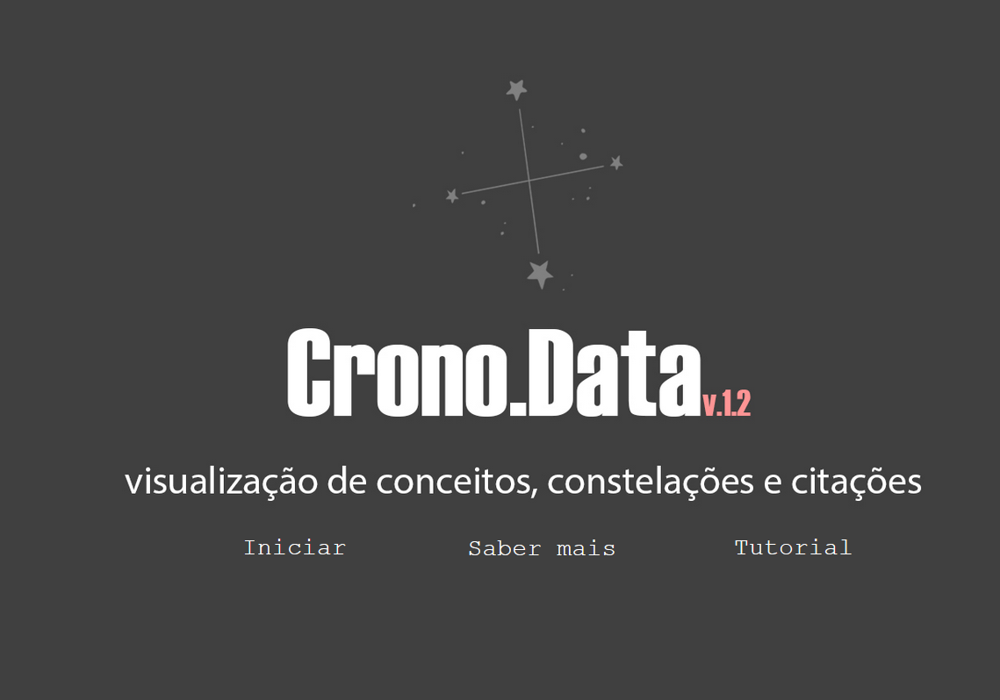

# Projeto de Hermenêutica Historiadora com Linguagens Computacionais

Bem-vindo(a) ao projeto de hermenêutica historiadora, que explora o uso de linguagens computacionais aplicadas à interpretação de acervos históricos digitalizados. Este repositório oferece scripts em Python para processamento e análise de dados, com duas versões para cada conjunto de ferramentas:

- **Versão Visual**: Inclui representações visuais dos resultados.
- **Versão Textual**: Contém apenas as saídas textuais das execuções.

## Descrição dos Códigos

Os códigos estão organizados em diferentes módulos, de acordo com a funcionalidade:

1. **Coleta de Acervos**: Scripts para coleta de dados em acervos históricos digitalizados.
2. **Processamento de PDF**: Ferramentas para criação de PDFs a partir de imagens, com reconhecimento de caracteres.
3. **Reconhecimento de OCR**: Scripts para reconhecimento óptico de caracteres (OCR) em PDFs.
4. **Montagem do Banco de Dados**: Ferramentas para estruturar um banco de dados a partir dos PDFs, com rótulos de intelectuais e conceitos.
5. **Construção de Matrizes de Similaridade**: Scripts para criação de matrizes que permitem análise de similaridade.
6. **Classificação de Conceitos com IA**: Ferramentas para classificação de conceitos utilizando Inteligência Artificial.

## Como Usar

1. **Clone o repositório**:
   ```bash
   git clone https://github.com/seu-usuario/seu-repositorio.git

## Configuração

Abra o projeto em um interpretador Python e siga as instruções nos documentos de instalação para pré-requisitos e configuração das bases de dados.

## Execução no Google Colab

Alternativamente, você pode executar o conjunto de linguagens computacionais diretamente no Google Colab:  
[Abrir no Google Colab](https://colab.research.google.com/drive/1Yul3ohEIOYYzisBT2FxVWBUYEmzOxwpQ?usp=sharing)

## Recursos Adicionais

- **Base de Dados Unificada**: A base de dados completa, com todas as rotulações para processamento de linguagem natural, está disponível no Repositório de Dados da Unicamp:  
  [DOI: 10.25824/redu/C2ILA2](https://doi.org/10.25824/redu/C2ILA2)

- **Bases de Dados Filtradas**: Para exercícios específicos, as bases de dados filtradas estão disponíveis na pasta `arquivos`.

- **Dashboard Interativo**: Visualize interativamente os conceitos e relações no dashboard:  
  [Dashboard Interativo](https://chd.ifch.unicamp.br/)

  

